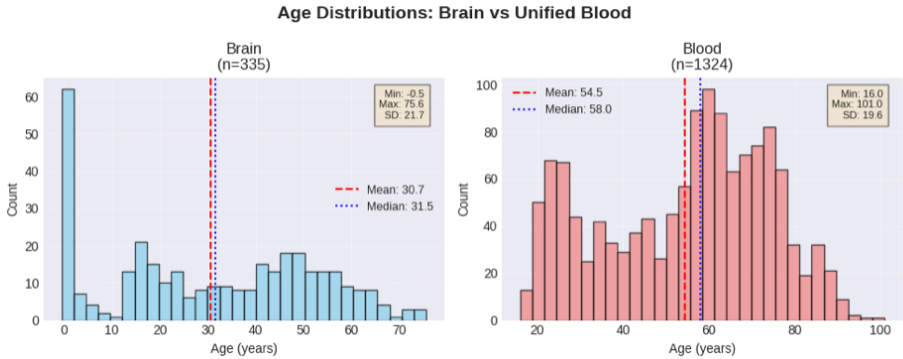

# Step 2 – Quality Control & Data Cleaning

This step focuses on "Quality Control" (QC). Before training a machine learning model, I have to ensure the DNA methylation data is clean, accurate, and free of technical errors.

###  The QC Process
I ran several checks on both the Brain and Blood datasets to ensure data integrity:
* **Missing Value Check:** Identified and removed samples or CpGs with high amounts of missing data. (The Blood dataset had 0.09% missing values; the Brain had 0.00%).
* **Beta Value Validation:** Verified all methylation values (Beta values) fell within the legal biological range of 0 to 1.
* **Sample Filtering:** Removed 2 low-quality samples from the Blood dataset to improve model accuracy.

---

###  Key Visualizations

#### 1. Age Distribution
This plot shows that our combined dataset covers almost the entire human lifespan, from prenatal stages (Brain) to over 100 years old (Blood).

#### 2. PCA Analysis (Principal Component Analysis)
I used PCA to visualize the structure of the data. This helps confirm that the biological differences between tissues are being captured correctly before we start the modeling.

---

###  CpG Overlap Analysis
Since I am working with two different tissues, I identified the **250 shared CpGs** that exist in both the Brain (50k variable sites) and the Unified Blood (1,670 shared sites) datasets. These 250 sites are the "bridge" for my cross-tissue analysis.

###  Outputs Created
* **Cleaned Methylation Matrices:** `cleaned_brain_methylation.csv` & `cleaned_blood_methylation.csv`
* **Cleaned Metadata:** Corrected age labels and filtered sample lists.
* **QC Reports:** A full summary of every sample removed and why.

The data is fully cleaned and standardized, making the project ready for **Step 3: Feature Selection**.
