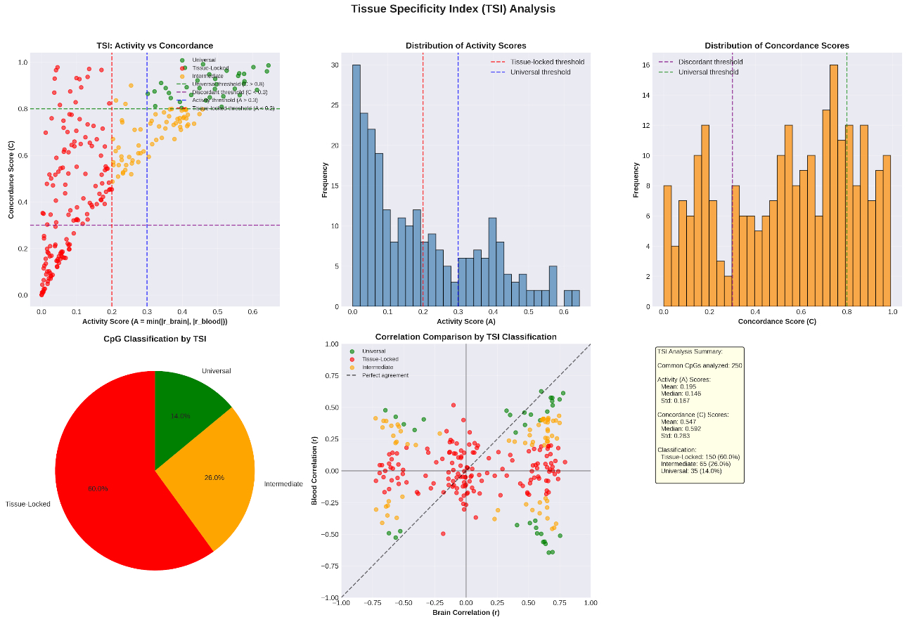

# Step 3 – Feature Discovery

In this step, I identify the specific CpG sites on the DNA that are most strongly associated with aging. Rather than analyzing the entire genome, I narrow the focus to the top 500 markers for each tissue to ensure high model accuracy and biological relevance.

### Research Summary
I used correlation analysis and a custom Tissue Specificity Index (TSI) to evaluate how aging markers behave across different tissues.

* **Brain Analysis:** Identified 38,707 significant aging sites. The strongest site achieved a correlation of 0.936 with chronological age.
* **Blood Analysis:** Identified 1,450 significant aging sites. The strongest site achieved a correlation of -0.740 with chronological age.
* **Comparison with Established Clocks:** I compared my findings to the Horvath and Hannum clocks. I identified 972 unique CpGs, meaning these markers are not currently utilized in those established epigenetic clocks.

---

### Tissue Specificity Index (TSI) Analysis
The TSI uses a **two-component framework** that separates the *presence* of aging signals from their *consistency* between tissues. This approach avoids conflating weak shared signals with tissue-restricted effects.

**The Framework:**
1. **Activity Score (A):** Measures presence of aging signal
   $$A = \min(|r_{brain}|, |r_{blood}|)$$
   
2. **Concordance Score (C):** Measures consistency of aging dynamics
   $$C = 1 - \frac{|r_{brain} - r_{blood}|}{|r_{brain}| + |r_{blood}|}$$

**Classification Rules:**
* **Universal:** A > 0.3 and C > 0.8 (strong signal in both tissues, highly consistent)
* **Tissue-Locked:** A < 0.2 (weak or absent signal in at least one tissue)
* **Discordant:** A > 0.3 and C < 0.3 (strong signals but divergent patterns)
* **Intermediate:** Everything else

**Analysis Results:**
I applied this framework to the **250 CpGs** shared between the brain and blood datasets. Even though these 250 sites exist in both tissues, their aging patterns vary significantly.

| Category | Count | Percentage | Biological Meaning |
| :--- | :--- | :--- | :--- |
| **Tissue-Locked** | 150 CpGs | 60.0% | Aging signals specific to one tissue's biology |
| **Intermediate** | 65 CpGs | 26.0% | Signals with partial tissue-specific modulation |
| **Universal** | 35 CpGs | 14.0% | Core aging signals conserved across both tissues |
| **Discordant** | 0 CpGs | 0.0% | No CpGs showed strong but opposite aging patterns |

**Key Insights:**
* **Mean Activity (A):** 0.195 indicates weak shared aging signals
* **Mean Concordance (C):** 0.547 indicates moderate consistency in aging dynamics
* **Dominant Tissue:** 76.4% of shared CpGs show stronger aging signals in brain

---

### Shared vs. Unique Markers
While I analyzed 50,000 CpGs in the brain and 1,670 in the blood, only 250 sites were common to both datasets. 

* **Shared (250 CpGs):** These allow direct comparison of aging patterns between tissues. However, **only 1 CpG appears in both top 500 lists**, showing extreme tissue specificity at the strongest markers.
* **Unique (Not Shared):** The vast majority of markers are unique to one dataset. This supports developing specialized "Tissue-Specific Clocks" that capture tissue-specific aging biology.

---

### Key Visualizations
#### 1. Correlation Scatterplots
These plots demonstrate the relationship between DNA methylation levels and chronological age for the top-ranked markers in both tissues.

#### 2. TSI Distribution
This graph shows how the 250 shared CpGs are distributed across the specificity spectrum, highlighting the difference between systemic and localized aging.

---

### Data Outputs
* **top_500_brain_cpgs.csv**: The 500 highest-performing markers for brain age prediction
* **top_500_blood_cpgs.csv**: The 500 highest-performing markers for blood age prediction
* **tissue_specificity_index_results.csv**: Complete TSI analysis for all 250 shared CpGs
* **tissue_locked_cpgs.csv**: 150 markers with tissue-specific aging patterns
* **universal_cpgs.csv**: 35 markers with conserved aging across tissues
* **intermediate_cpgs.csv**: 65 markers with partial tissue specificity
* **epigenetic_clock_comparison.csv**: Overlap analysis with Horvath and Hannum clocks

Now that feature discovery is complete, we can now move on to **Step 4: Epigenetic Clock Training**.
