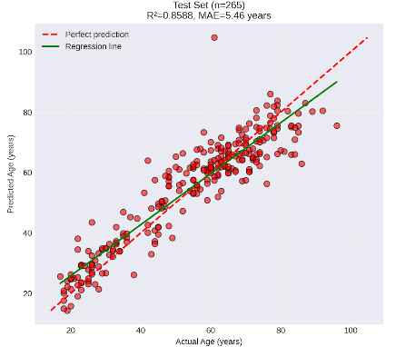
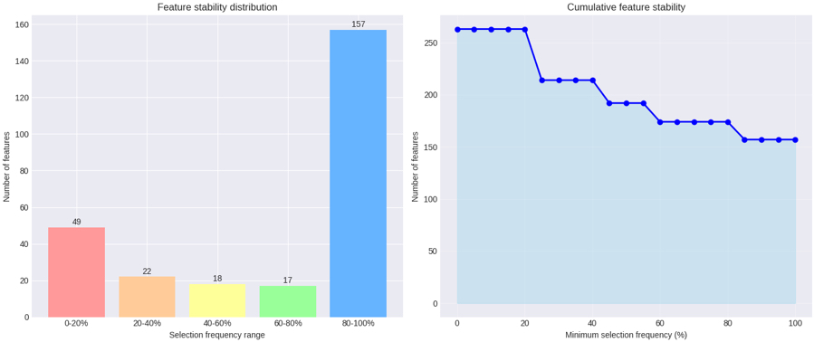

# Step 4 – Epigenetic Clock Training

In this step, I trained and optimized tissue-specific machine learning models to predict chronological age from DNA methylation data. I used an ElasticNet Regressor combined with a Bagging Ensemble approach to ensure the models are stable and do not overfit.

### Model Performance Summary

I evaluated the models based on Mean Absolute Error (MAE), which represents the average difference between the predicted age and actual age, and R² (accuracy).

| Tissue | Samples (N) | Features (CpGs) | Test MAE | Test R² | Correlation |
| :--- | :--- | :--- | :--- | :--- | :--- |
| **Brain** | 335 | 174 | 2.51 years | 0.9708 | 0.985 |
| **Blood** | 1,322 | 500 | 5.46 years | 0.8588 | 0.927 |

### Interpretation of Tissue-Specific Performance
The superior performance of the Brain epigenetic clock reflects stronger individual CpG–age correlations identified in Step 3, 
enabling the selection of a compact and highly stable feature set (174 CpGs) compared to Blood (500 CpGs). 
In Blood, many weaker CpG-level signals can be aggregated into a strong model-level predictor (r = 0.927), 
but lower individual effect sizes reduce feature stability and increase prediction error. Blood clock performance 
is expected to improve with increased sample size and improved modeling of cellular heterogeneity.

### Optimization Strategy
To achieve these results, I performed a multi-stage optimization process:
* **Feature Size Optimization:** Tested different numbers of CpGs to find the best amount where accuracy is highest without including unnecessary noise.
* **Hyperparameter Tuning:** Used a randomized search to find the best Alpha and L1 ratios for the ElasticNet models.
* **Feature Stability Analysis:** Used 5-fold cross-validation to identify which CpGs were consistently selected across different groups of data. For the brain, 157 features were identified as extremely stable.
* **Ensemble Learning:** Implemented a Bagging Ensemble (30-50 estimators) to reduce variance and improve the model's ability to work on new, unseen data.

---

### Key Visualizations
#### 1. Prediction Accuracy 
This plot compares predicted age vs. actual age. The tight clustering along the 45-degree line (representing ideal performance) shows the model is accurate across the entire lifespan.
<table>
<tr>
<td>

</td>
<td>

</td>
</tr>
</table>

#### 2. Feature Stability
This chart shows how many CpGs were consistently chosen by the **Brain model** during cross-validation. High stability indicates that the model is picking up real biological signals. 

For the Blood model, the pre-selected 500 CpGs exhibited 100% stability, confirming that these markers provide a consistent and reliable foundation for age prediction. Feature selection was carefully optimized—testing different numbers of CpGs—to ensure the Blood Clock captures a true biological signal rather than overfitting to noise, maximizing predictive performance.

---

### Future Work and Next Steps
* **Universal Clock:** I plan to develop a "Universal Clock" using the 35 universal CpGs identified via the Tissue Specificity Index (TSI) in Step 3. 
* **External Validation:** To prove these models work on independent data, I am planning to validate the Brain clock using the **ROSMAP** dataset. External validation for the Blood clock is also planned as more datasets become available.
* **Expanding Data:** I am actively looking for more samples for both tissues to further improve the model's precision and diversity.

Since training is now complete for the primary tissue-specific clocks, we can move on to **Step 5: Residual Analysis and Age Acceleration**.
