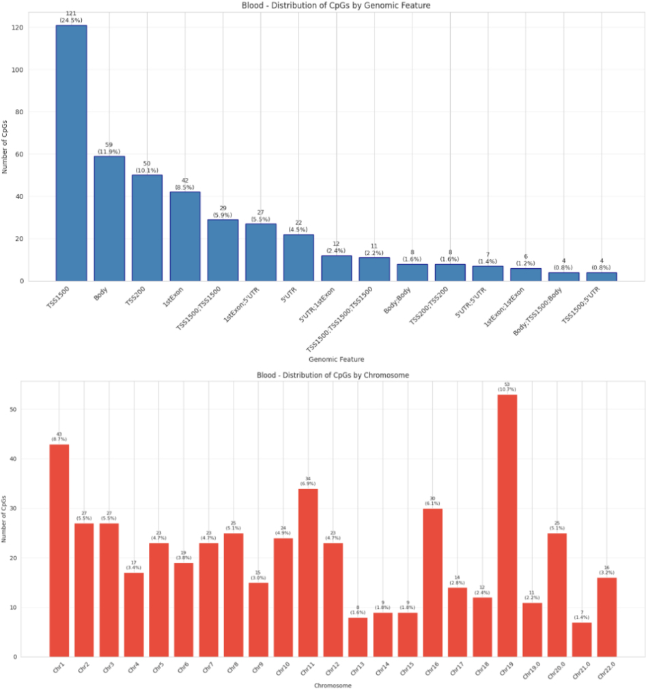

# Step 10 – Comparative Analysis of DMRs and Genes

In this step, I performed a high-level comparative analysis to move beyond individual CpG probes. I focused on identifying **Differentially Methylated Regions (DMRs)**—clusters of CpGs that change together—and analyzed how the genomic landscape of aging differs between Brain and Blood tissues.

---

### Genomic Context and Feature Distribution
I analyzed the physical locations of my top aging markers within genes and uncovered a striking difference in the genomic organization of aging between the two tissues:

* **Blood Tissue:** Aging is dominated by the **Promoter Region**. Approximately **24.5%** of markers are located in the **TSS1500** (1500bp from the Transcription Start Site). This indicates that the aging of blood is largely driven by the activation or suppression of specific genes.
* **Brain Tissue:** Aging is dominated by the **Gene Body**. Over **32.6%** of markers are located within the interior of the gene. This suggests that brain aging may involve more complex regulation of gene stability or alternative splicing, rather than straightforward on/off switching.

---

### DMR Clustering and Gene Prioritization
Individual CpGs are interesting, but multiple CpGs in the same region (DMRs) provide much stronger biological evidence. I clustered my top 500 CpGs into functional regions:

| Metric | Blood Analysis | Brain Analysis |
| :--- | :--- | :--- |
| **DMR Clusters** | 472 Clusters | 350 Clusters |
| **Top Multi-CpG Gene** | **TDRD5** (2 CpGs) | **DIP2C** (5 CpGs) |
| **Key Aging Markers** | *WT1, LEP, OXT* | *ELOVL2, SREBF1, HDAC4* |

**Brain Complexity:** I found that Brain aging markers tend to cluster more tightly, with genes like **DIP2C** and **ELOVL2** showing high-density methylation shifts (up to 5 CpGs in a single region).

---

### Tissue-Specific Pathway Enrichment
I ran a comparative functional analysis on the unique gene lists (510 Blood-specific vs. 350 Brain-specific) to define their distinct biological roles:

* **Blood-Specific (107 Terms):** Heavily enriched for cell-cell adhesion and plasma membrane signaling.
* **Brain-Specific (39 Terms):** Focused on cellular developmental processes and anatomical structure maturation.

---

###  Key Visualizations

* **Genomic Context Distribution:** A side-by-side comparison of where aging CpGs fall within gene structures (e.g., Promoter vs. Body), illustrating the unique regulatory logic of each tissue.

---

###  Future Goal: PPI Network Analysis (WIP)
As I refine this step, I plan to integrate **Protein-Protein Interaction (PPI) Network Analysis**. 
By running my unique gene lists and the **13 shared genes (identified in Step 6)** through **STRING-db**, 
I aim to determine whether these genes form a functional network associated with aging.
This will prove that the markers aren't just random sites, but key players in an interconnected biological machine.

---

###  Key Outputs Created
* `unique_brain_pathways.csv` & `unique_blood_pathways.csv`: Final tissue-specific functional results.
* `brain_predictions.csv` & `blood_predictions.csv`: Aligned datasets for the final comparative model.
* `tissue_comparison_summary.txt`: A technical summary of DMR and gene body vs. promoter findings.

**Current Status:** The comparative genomic landscape is now mapped, revealing a promoter-focused pattern of aging in blood versus a gene-body–focused pattern in the brain.
Enabling us to move on to **Step 11: Enhanced Epigenetic Deconvolution and Causal Inference**

---
