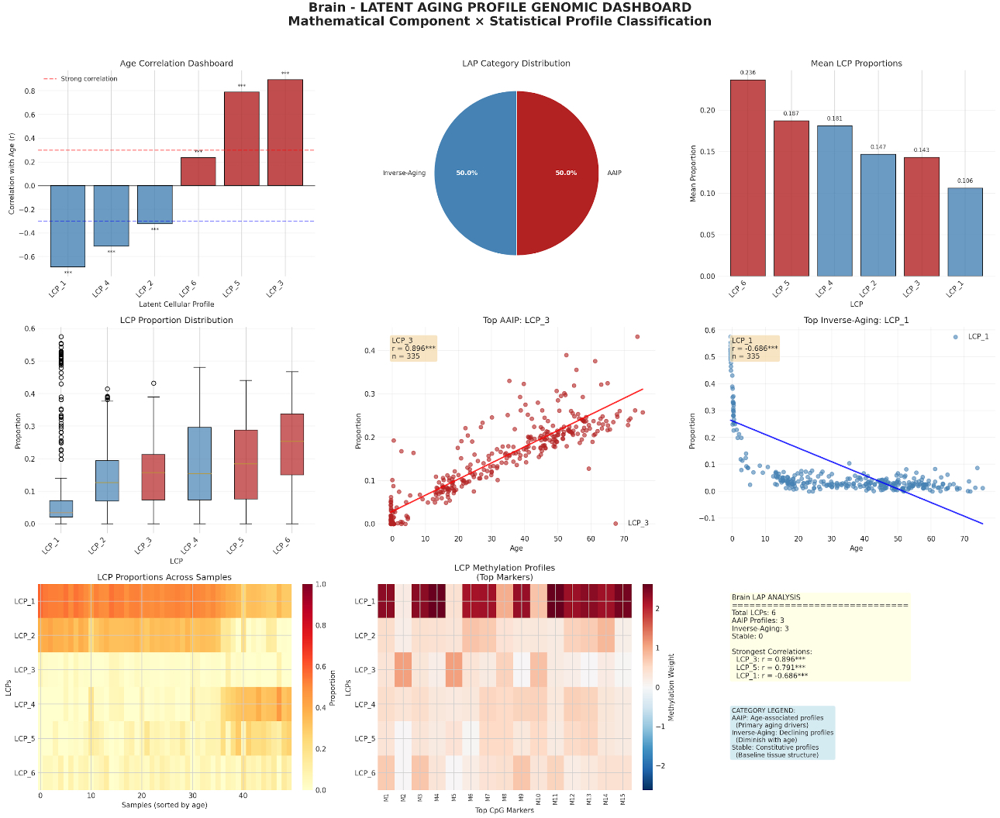

# Step 11: Latent Aging Profile (LAP) Analysis & Causal Framework

In this phase, the project moves beyond bulk tissue observations to implement a high-resolution **Latent Aging Profile (LAP)** framework. By utilizing a hybrid approach of **Mathematical Decomposition** and **Statistical Stratification**, the biological signals of aging have been unmixed into distinct cellular trajectories for both blood and brain tissues.

---

### Analytical Framework: The Hybrid Methodology

The analysis follows a two-stage structural logic to ensure that mathematical extractions are grounded in statistical behavior.

#### 1. Mathematical Component Phase (NMF Extraction)
The methylation data is treated as a composite signal. **Non-negative Matrix Factorization (NMF)** is used to decompose high-dimensional CpG matrices into two constituent sub-matrices:
* **The Basis Matrix ($W$):** Defining the unique epigenetic signatures of each **Latent Cellular Profile (LCP)**.
* **The Coefficient Matrix ($H$):** Providing the relative proportions of these profiles across all samples.

#### 2. Statistical Profile Phase (Functional Classification)
To move from mathematical abstraction to biological interpretation, **Pearson correlation analyses** were performed between LCP proportions and chronological age. This allows for a functional hierarchy based on aging dynamics:

| Profile Category | Description | Aging Direction | Biological Significance |
| :--- | :--- | :--- | :--- |
| **AAIP (Strong)** | Age-Associated Inferred Profiles | Positive Correlation | Primary drivers of the epigenetic aging signal. |
| **Inverse-Aging** | Declining Profiles | Negative Correlation | Cellular populations that diminish or "exhaust" over time. |
| **Stable** | Constitutive Profiles | Near-Zero Correlation | The baseline structural composition of the tissue. |

---

### Analysis Results and Model Performance

The following table summarizes the mathematical and statistical output for both the Blood and Brain datasets. The **NMF Reconstruction Error** indicates the accuracy of the decomposition, with lower values representing a more precise fit.

| Metric | Blood | Brain |
| :--- | :--- | :--- |
| LCPs Extracted | 5 | 6 |
| Samples | 1322 | 335 |
| CpGs | 500 | 500 |
| Age Samples | 1322 | 335 |
| AAIP Profiles | 4 | 3 |
| Inverse-Aging Profiles | 1 | 3 |
| Stable Profiles | 0 | 0 |
| NMF Reconstruction Error | 50.9019 | 13.0250 |
| Dashboard Panels | 9 | 9 |

---

### Key Visualizations

The primary analytical outputs consist of two comprehensive 9-panel dashboards: one for the whole blood dataset and one for the brain prefrontal cortex samples. These visualizations provide a high-dimensional overview of how the extracted mathematical components correlate with biological aging.

---

---

### Future Objectives: Biological Annotation & Causal Inference

While the mathematical infrastructure is finalized, I will now move into the biological validation phase. The following objectives represent the next steps in my pipeline:

#### 1. Reference-Based Identification
I will cross-reference the marker CpGs identified for each LCP against established genomic databases, including **PanglaoDB**, the **Allen Brain Map**, and **ENCODE**. My goal is to transition from numerical placeholders (e.g., LCP_5) to definitive biological identities, such as **Astrocytes**, **Neurons**, or specific **T-cell subtypes**.

#### 2. Causal Mediation & Clock Adjustment
Once I have assigned biological labels to these profiles, I will execute a series of causal inference tests to determine the true origin of the Epigenetic Clock signal:

* **Attenuation Analysis:** I will regress Epigenetic Age Acceleration (EAA) against cell proportions to test whether the clock signal is primarily a reflection of compositional shifts rather than intracellular aging.
* **Intrinsic Clock Refinement:** If I observe high attenuation, I will construct "cell-adjusted" clocks (modeled after the **IntrinClock** approach). I will then test if these residual aging signals provide superior predictive power for health outcomes compared to standard bulk tissue clocks.

---

### Current Status
The mathematical architecture is verified and stable. Additional technical steps to be included in the future will be briefly mentioned in the main README of the repository. Step 11 provides the required foundation for investigating whether these cellular shifts cause aging or are markers of the process.

